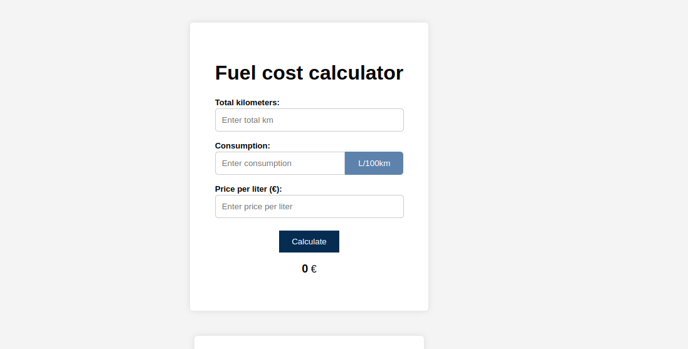

# Travel fuel cost calculator

The Travel Fuel Cost Calculator is a web application that allows users to calculate the cost of a journey based on the distance traveled, fuel consumption, and gas cost. It also provides a convenient conversion tool between two common fuel consumption units: kilometers per liter (km/l) and liters per 100 kilometers (l/100 km).

## Features

- Calculate the cost of a journey based on user inputs:
  - Distance in kilometers (km).
  - Fuel consumption in either kilometers per liter (km/l) or liters per 100 kilometers (l/100 km).
  - Gas cost per liter.
- Convert between kilometers per liter (km/l) and liters per 100 kilometers (l/100 km) easily.
- User-friendly and intuitive interface.
- Facilitates efficient trip planning.

## Preview

## License

This project is licensed under the MIT License

## Acknowledgments

This web app was created for personal use but also for learning and educational purposes.

## Try it 
You can access the live version of the app here: [Live Demo](https://travel-fuel-cost.vercel.app/)
